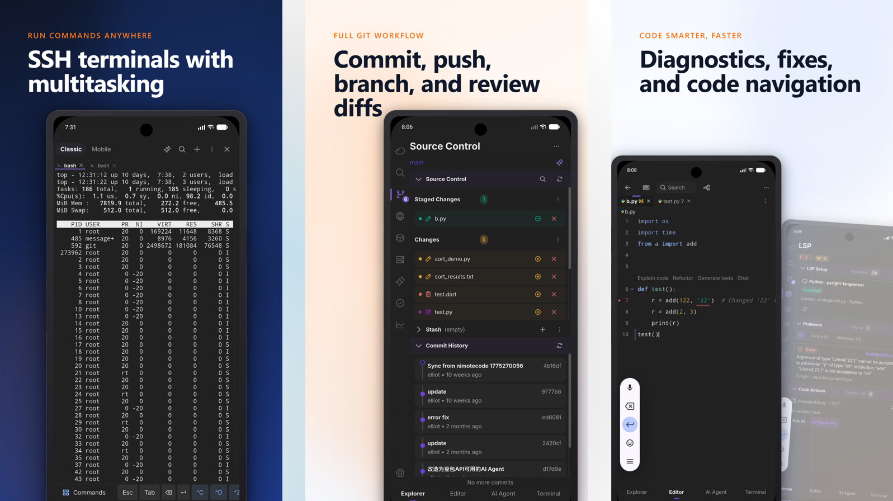
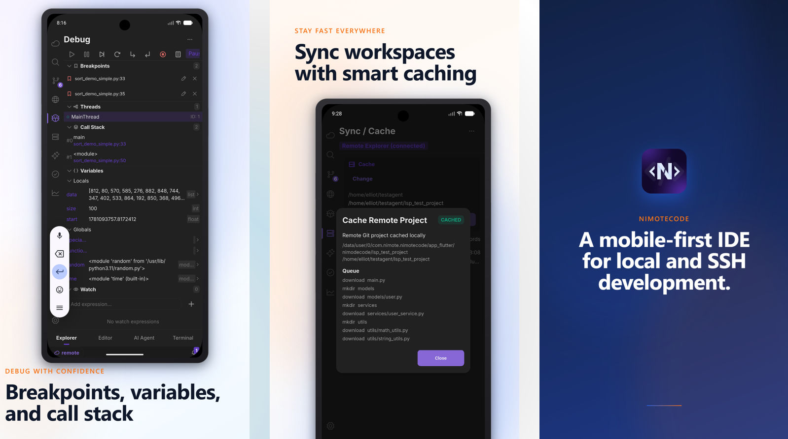

# NimoteCode

  <a href="./README.md">English</a> · <a href="./README.zh-CN.md">简体中文</a>

  <strong>Mobile-first AI Development Environment</strong> 
  <strong>Code on your phone or tablet with your real projects.</strong>

  NimoteCode is a mobile IDE and SSH IDE for Android and iOS that brings real software-development workflows to mobile devices: local or SSH workspaces, terminal + Git, AI agent tasks, and on-device code review. Android is available now; iOS is under App Store review.

  
  
  
  
  

> NimoteCode is a **Mobile-first AI Development Environment**.  
> **The latest Android version is available on Google Play. App Store availability is under review.**

If you're on Android, start with the step-by-step guide and install from Google Play:
[Use Android as a remote IDE with Tailscale and NimoteCode](https://nimotecode.com/blog/tailscale-ssh-android-mac-linux) → [Install from Google Play](https://play.google.com/store/apps/details?id=com.nimote.nimotecode).

## What NimoteCode is

- **Mobile IDE**: full coding workspace on phone/tablet.
- **Remote SSH Development**: connect to your existing Mac/Linux machine or VPS.
- **AI Agent**: product-brief-to-diff workflow (plan, edit, run, verify, repair).
- **Terminal**: execute project commands, tasks, and diagnostics.
- **Git**: inspect status, diffs, and history in one workflow.
- **Real development, anywhere**: continue work when you're away from your desk.

## AI Agent workflow: from brief to reviewable Git result

Give the Agent a product brief, then follow one loop: **plan → inspect the project → edit files → run checks → repair failures → review the Git result**. This is AI coding in the project workspace, not just chat.

  <video src="https://github.com/user-attachments/assets/531d62fc-4874-41b9-96af-1ac9d2ad6fd6" controls muted playsinline width="420">
    Your browser does not support embedded video. Open the <a href="https://github.com/user-attachments/assets/531d62fc-4874-41b9-96af-1ac9d2ad6fd6">AI Agent demo video</a> instead.
  </video>

If the embedded player is unavailable in your GitHub client, [watch the AI Agent demo](https://github.com/user-attachments/assets/531d62fc-4874-41b9-96af-1ac9d2ad6fd6).

## Why NimoteCode

| Core capability | What it means for mobile coding |
| --- | --- |
| **Real Workspaces** | Open local projects or connect to your actual development machine or VPS over SSH. |
| **AI Coding Agent** | Plan, inspect, edit, run, repair, and verify multi-step development tasks in the active project. |
| **Real Developer Tools** | Use a code editor, Terminal, Git client, search, diagnostics, Tasks, and debugging tools. |
| **Built for Mobile** | Continue meaningful phone or tablet coding when you are away from your desk. |

## Core features

- Local and SSH workspaces for remote development
- Explorer and full code editor for navigating and editing projects
- Terminal for commands, logs, tests, and configured CLI tools
- Git Source Control for status, diffs, history, and review workflows
- AI Chat and AI coding Agent for project-aware assistance and tasks
- Search, diagnostics, Tasks, LSP, Debug, and Sync / Cache workflows where configured

## Mobile development capabilities

### Workspaces, editor, and AI Agent

Browse, search, and edit projects in local files or an SSH workspace, then use the AI Agent for multi-step tasks.

  

### SSH terminal, Git, and code diagnostics

Run commands in an SSH terminal, commit, push, branch, and review diffs with Git, and use diagnostics and code navigation to find issues.

  

### Debugging and workspace sync

Set breakpoints, inspect variables and call stacks, and synchronize remote workspaces with smart caching.

  

## AI coding on your real project

NimoteCode combines AI Chat and an autonomous coding Agent with the tools needed to validate outcomes: project files, editor, terminal output, tasks, diagnostics, and Git Source Control.

## Use your favorite coding tools from Terminal

Run configured CLI-based AI coding tools in the active local or SSH workspace, including [Codex](https://nimotecode.com/codex-from-phone), [Claude Code](https://nimotecode.com/claude-code-from-phone), Kimi, and similar terminal tools. For Codex mobile and Claude Code mobile workflows, NimoteCode keeps the CLI, project files, terminal output, and Git review together. It does not bundle model subscriptions: configure your own providers, accounts, or BYOK access where applicable.

## Download

- **Official Website:** https://nimotecode.com
- **Google Play (latest):** https://play.google.com/store/apps/details?id=com.nimote.nimotecode
- **App Store:** Under review for release
- **GitHub Releases (legacy/historical builds):** https://github.com/aounma/nimotecode-ai-powered-mobile-ide/releases

The latest Android release is always on Google Play. App Store availability will be announced after approval.

## Get started

1. Install NimoteCode from Google Play. App Store availability is under review.
2. Open a [local workspace or connect over SSH](https://nimotecode.com/docs/ssh).
3. [Edit code or start an AI Agent task](https://nimotecode.com/docs/ai).
4. Run the project or checks in [Terminal](https://nimotecode.com/docs/terminal).
5. Review changes in [Git Source Control](https://nimotecode.com/docs/source-control).

## Links

- [Start with SSH](https://nimotecode.com/docs/ssh)
- [Watch workflows](https://nimotecode.com/use-cases/)
- [Official documentation](https://nimotecode.com/docs/quick-start)
- [Join our Discord community](https://discord.gg/tTxbpqYmhR)
- [Report an issue](https://github.com/mobiledevloperlab/nimote_issues/issues)

## Repository and release notes

- This repository is the NimoteCode website repository (docs, landing pages, and public content), not the private application source code repository.
- GitHub Releases are for legacy / historical builds only.
- Google Play is the current official release channel; App Store availability is under review.
- NimoteCode is currently **closed source**.

## Safety

Review AI-assisted changes before committing or deploying. Verify commands and test results, then inspect Git diffs before delivery.
